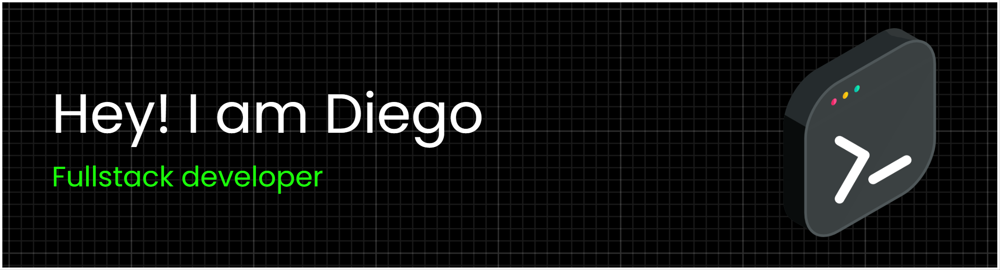

 

### About Me

Full stack developer building web applications end to end — from API to UI. Comfortable across JavaScript/Node.js and Python on the backend, React on the front. Currently deepening my knowledge of data structures & algorithms via [roadmap.sh](https://roadmap.sh/datastructures-and-algorithms), and always open to interesting projects and collaboration.

### Tech Stack

**Languages & Frameworks**

  
  
  
  
  
  
  
  
  

**Tools & Platforms**

  
  
  
  
  
  

### Let's Connect

  
  

Last updated: July 2026
